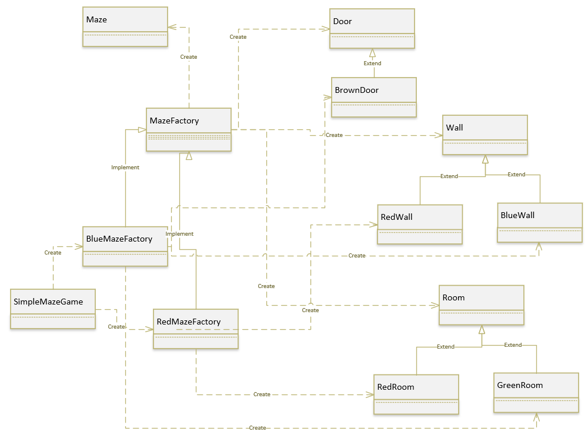
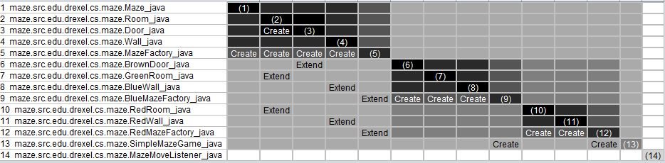
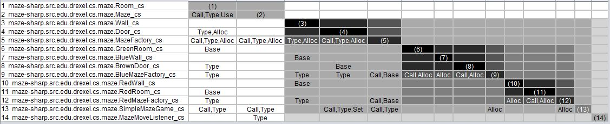

## Welcome to InPAD

Here you can find information about InPAD, our long term project for building an interactive and language independent pattern detection framework. InPAD is being built based on  the  rationale  that,  regardless  of  the  language  in  use  andpossible  variations  a  pattern  may  have,  the  major  objectiveof  pattern  application  is  decoupling  a  complex  system  intomodules  by  injecting  key  interfaces. Here is our research  objectives:

- enable the user to express the key design abstractions of patterns interactively and automatically extract the modular structure of individual pattern spaces;
- enable language-agnostic pattern detection through configuration;
- advance our understanding on how patterns are applied in practice by creating a pattern respository extracted from large scale software systems.

### Architecture and Design Patterns

Design Pattern Structure represented using UML.

For illustration purposes, we use the Abstract Factory Pattern. The Abstract Factory pattern features an interface for creating a family of concrete factory objects without specifying their concrete classes at compile time.  The Abstract Factory pattern can be used, for example, when a system should be independent of how its products are created or if the system should be configured with one of the multiple families of products.  Figure 2 shows the UML representation for the Abstract Factory in the Maze system.  

The Abstract Factory pattern has 5 roles, each fulfilled by one or more java classes:

* Abstract Factory (MazeFactory.java) declares an interface for operations that are common to all factory objects.
* Concrete Factory (BlueMazeFactory.java,  RedMazeFactory.java) implements the operations to create concrete product objects.
* Abstract Product (Door.java, Wall.java, Room.java) declares interfaces for product objects.
* Concrete  Product  (BrownDoor.java,  RedWall.java,  BlueWall.java,  RedRoom.java,  Green-Room.java)  defines  concrete  product  objects  to  be  created  by  the  corresponding  concrete factory object.
* Client (SimpleMazeGame) uses only interfaces declared by Abstract Factory and AbstractProduct classes.

Design Pattern Structure represented using DSM and DRSpaces

- Design Structure Matrix [2]
- Design Rule Space (DRSpace) [3]. 
- DV8 [4] 

The example bellow depicts the DRSpace of an Abstract Factory Pattern implemented in Java. The cell $(r_{10}, c_6}$  indicates that $BlueMazeFactory$, a concrete factory class, depends on $MazeFactory$. The DRSpace is clustered into a DRH with 3 layers: l1: (rc1-rc6), l2: (rc7-rc14), and l3: (rc15). In the second layer, there are 2 independent inner modules, m1: (rc7-rc10) and m2 (rc11-rc14). The cells in a DSM can be tailored to represent the type of structural dependency among the files. For example, the class $MazeFactory.java$ is responsible for instantiating the $Maze$, which can represented as a CREATE relationship. An Abstract Factory pattern must have an entity, class, files, etc., that takes the role of ABSTRACT FACTORY, which should be an interface (design rule) that decouples concrete factories.. Also, the key interfaces of the system, $MapSite, Room, Door, Wall, Maze$, and the pattern interface, $MazeFactory$ serve as the design rules that decouple other Java classes into two independent modules: File 7 to 10 form a BlueMazeFactory module, and File 11 to 14 form a RedMazeFactory module. File 15 is the control class and the entry point of the system, which depends on the design rules and two concrete factory classes. Most patterns should have a DRSpace with a clear modular structure. We manipulate DSM using the DV8 tool suites. Instead of viewing software architecture design as simply a set of entities and relations, we herein consider that architecture is structured by design rules and their subordinating independent modules.  

Java

The abstract factory interface provides a set of operations that create abstract products. Also, there must exist at least one corresponding abstract product related to each instance of an abstract factory. For a concrete factory, there exists a subclass that inherits the abstract factory interface and creates at least one concrete product (or even a family of concrete products).

A concrete factory have an implement relationships with a parent class, and it can create other sub-classes corresponding to concrete products. An abstract product interface declares an interface for a type (or family) of product objects. Therefore, there might exist a subclass that extends an abstract product, and it has a create relationship with one or more concrete factory. A concrete product consists of a subclass of an abstract product to be created by the corresponding concrete factory.

C#

To illustrate the feasibility of our approach, we processed the same maze game program applying the abstract factory pattern written in C\#. Relationships are represented differently from the Java version. For example, the inheritance between $.maze.GreenRoom$ and $.maze.Room$ in the cell(r6, c1) is expressed as a BASE relationship, and the creation of maze.Maze$ by maze.MazeFactory$, as shown in the cell(r5, c2) is expressed by the structural dependency ALLOC. Although each programming language has different types of relationships, these structural dependencies are semantically equivalent. 

### References

[1] E. Gamma, R. Helm, R. Johnson, and J. Vlissides, Design Patterns: Elements of Reusable Object Oriented Software. 1995.

[2]C. Y. Baldwin and K. B. Clark, “Design Rules, Vol. 1 The Power of Modularity,” MIT Press, Cambridge, 2000.

[3]L. Xiao, Y. Cai, and R. Kazman, “Design rule spaces: a new form of architecture insight.,” In  Proc. International Conference on Software Engineering, pp. 967–977, ACM, 2014.

[4]R. Mo, W. Snipes, Y. Cai, S. Ramaswamy, R. Kazman, and M. Naedele,
“Experiences applying automated architecture analysis tool suites”. In proc.
of the 33rd ACM/IEEE International Conference on Automated Software Engineering, ASE 2018, pp. 779–789, ACM, 2018.